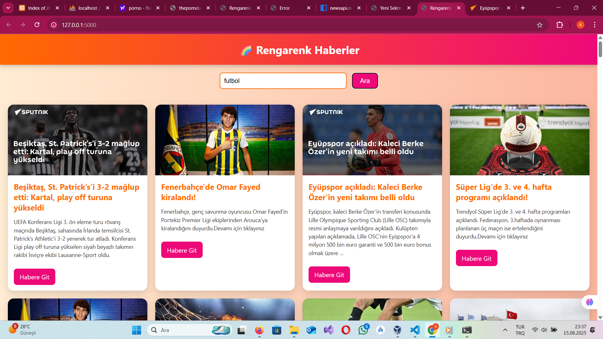

# News Api

**News Api** is a modern, colorful, and user-friendly news platform built with Python and Flask. Users can search for news topics they are interested in and access detailed content.

---

## 🚀 Features
- 🌈 Colorful and modern interface
- 🔍 News search functionality
- 📰 News headlines, summaries, and images
- 📱 Mobile-friendly and responsive design

---

## 🖼️ Project Screenshots


 


 


  


 


---

## ⚙️ Installation

1. Clone the repository:  
```bash
git clone https://github.com/AhmetFarukTUNC/NEWSAPI
